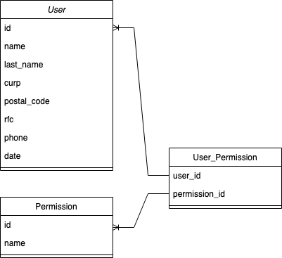

# GS_Test

Consideraciones principales:
* Tener instalado python en una version igual o superior a 3.7.
* Tener instalado el manejador de paquetes pip.


## Entorno virtual

### MacOs / Unix
Abrir un shell y navegar hasta la carpeta donde se situará el proyecto.
Dentro de la carpeta creará un entorno virtual ejecutando en la consola:
```
    python3 -m venv env
```

### MacOs / Unix
Abrir un shell y navegar hasta la carpeta donde se situará el proyecto.
dentro de la carpeta creará un entorno virtual ejecutando en la consola:

```
    python -m venv env
```

Es importante tener en cuenta que ya deberia haber registrado dentro de
las variables de entorno el PATH de python para poder utilizar el comando
"python"

Nota: Si ocurre algún problema con el entorno virtual, siempre se puede consultar 
la documentación oficial: https://docs.python.org/3/library/venv.html

Una vez creado nuestro entorno virtual lo activaremos de la siguiente forma:

para MacOs o Unix:

```
    source env/bin/activate
```

para windows:
```
    env\Scripts\activate
```

Una vez tengamos activo el entorno virtual, procedemos a instalar todas las 
dependencias del proyecto.

## Instalacion de dependecias
Nos situaremos en nuestro shell a nivel del archivo manage.py, luego
con nuestro entorno virtual activo escribimos el siguiente comando:
```
    pip insall -r requirements.txt
```
## Configuracion .env
Cuando tengamos nuestras dependencias instaladas procederemos a agregar un archivo en la carpeta app llamado “.env” y escribiremos lo mismo que tiene el archivo env.example, modificando la configuración de la base de datos en postgres, ahí pondremos los datos que nos indica el apratado "#DATABASE SETTINGS".

## Migraciones
Una vez instaladas las dependencias y creada nuestra base de datos junto con su configuración, procedemos a correr las migraciones, por tanto escribimos dentro del shell el siguiente comando:

```
    python manage.py migrate
```

## Crear el admin principal
Cuando tengamos las migraciones listas, crearemos el primer usuario y el administrador base, con el cual nos podemos autenticar y comenzar a crear nuevos usuarios y permisos, así como enlazarlos. Corremos el comando:

```
    python manage.py createsuperuser
```

nos pedirá un correo (como recomendación utilizar dev@gmail.com tal como aparece en postman) y una contraseña (utilizar “test” tal como en el ejemplo de postan), tendremos que repetir la contraseña y al final pondremos la tecla y para indicar que sabemos que es una contraseña corta.

## Correr el proyecto
Sin brincar ninguno de los pasos anteriores, ahora toca arrancar el proyecto. Escribiremos dentro del shell el siguiente comando:

```
    python manage.py runserver
```
lo siguiente que podemos hacer es consultar la documentación de la API disponible en la URL:  http://localhost:8000/

De igual forma podemos testear la API desde Postman generando un token con el usuario que creamos y colocando el token dentro de la autorización de cada petición.


# Resumen del proyecto

Esta prueba la diseñe con el modelo siguiente:



Diseñe la aplicación de esa forma teniendo en cuenta el siempre ser dinámico, pensando en la escalabilidad que llega a tener una aplicación y en no depender de un administrador que este haciendo correcciones a futuro. 

Mi idea principal es que al tener un modelo de permisos podemos hacer crecer la lista de estos mismos, tantos como el cliente quiera. Al hacerlo en una aplicación aparte me permite encapsular todo lo relacionado con los permisos, haciendo crecer el modelo de manera aislada y hasta cierta forma controlada. De la misma forma en que podemos asociar los permisos a los usuarios, la idea es asociarlos a los endpoints, haciendo que cada endpoint tenga una lista de permisos que pueda comparar cada que un usuario hace una petición (pudiendo implementar esta lógica dentro de un middleware modificando la petición, sumando los permisos). 

Desafortunadamente no tuve el tiempo de construir el flujo de los permisos dentro de los endpoints, puesto que presté atención en las validaciones y la construcción general de la aplicación, creando el sistema de autenticación, la documentación y los archivos que nos ayuden a testear la aplicación.

Nota: Dentro de la carpeta docs encontraran el archivo de postman con ejemplos y los endpoints con una configuración inicial para probar el api.